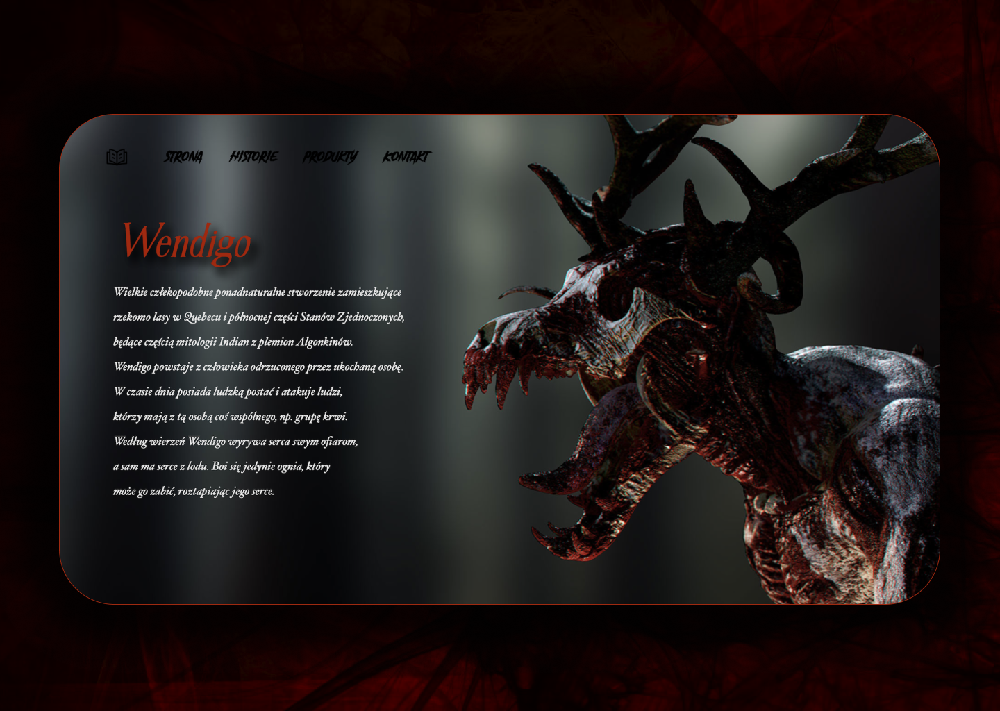

# WENDIGO

## Description
This is a simple static page created with HTML/CSS. A simple and quick way to learn how to create websites for novice programmers :thumbsup::mortar_board:

## Technologies used
- HTML
- CSS

# My Portfolio :smiling_imp:
### [Behance](https://www.behance.net/KarolKomorowski) :computer:

### [Github](https://github.com/FLaMeREVENGE) :paw_prints:

